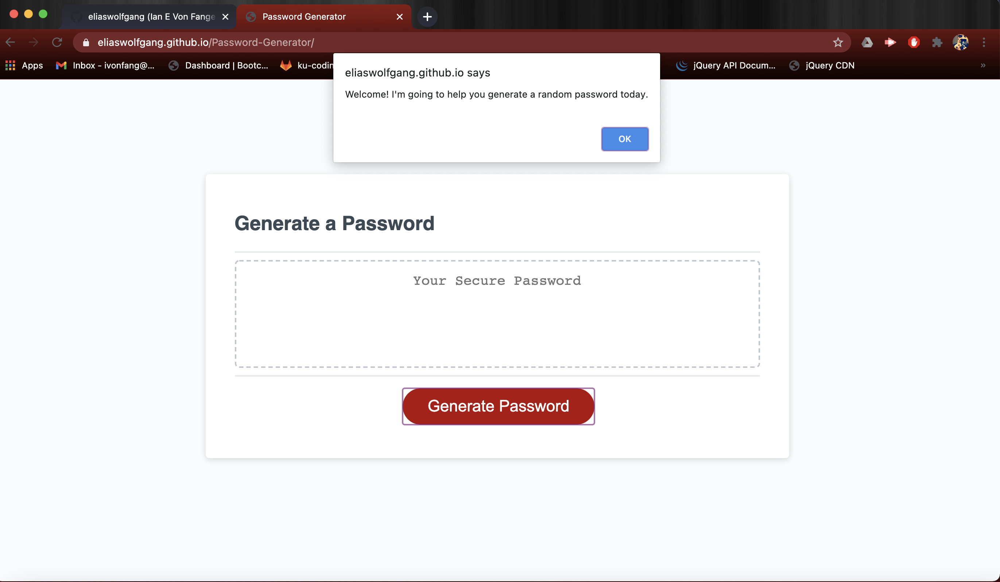
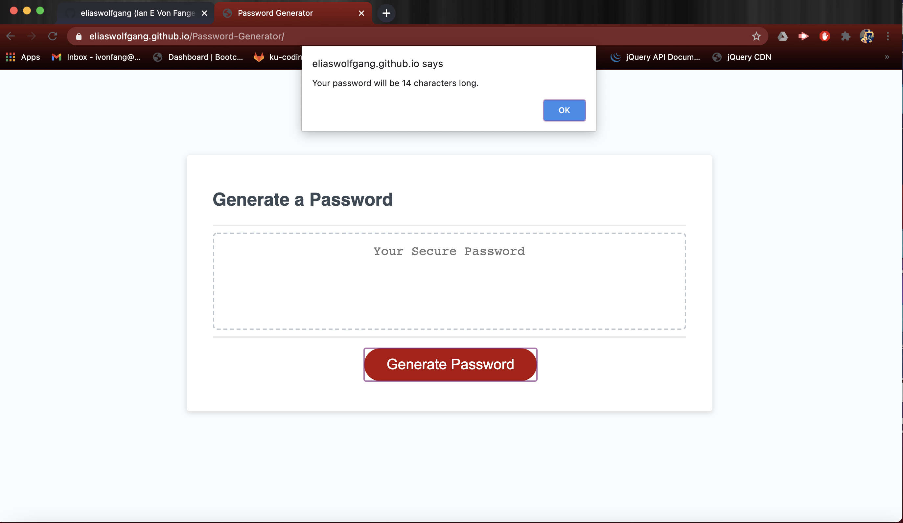
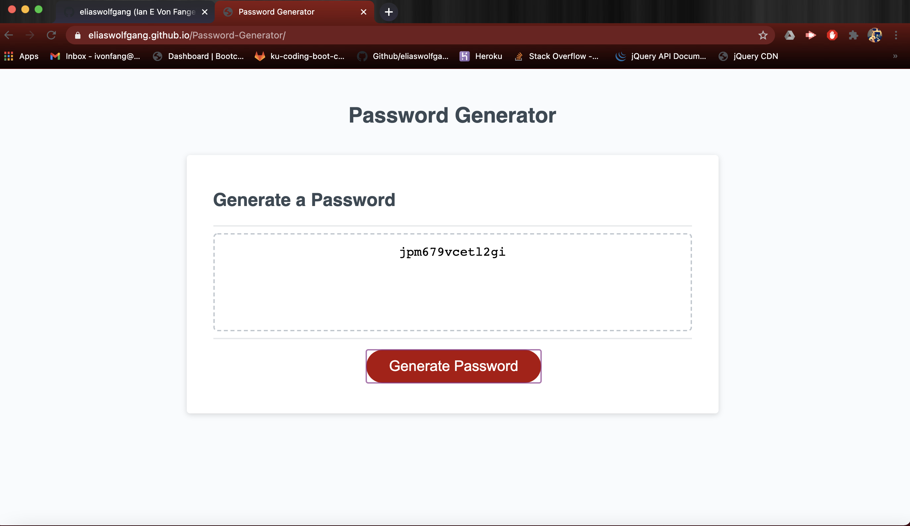

# Password-Generator

## Description
This dynamic password generator application randomly generates a password based on a length specified by the user. 
Through a series of prompts, users are given the option to include lowercase letters, uppercase letters, numbers, and special characters in their passwords. Every password generated will be a random combination of characters based on those acceptable criteria.
The generated password is passed to the simple HTML of the page and is fully deployable. All the user needs to do is copy and paste!

## Specs & Testing
The randomization of this password generator was achieved using the updated ES6 Durstenfeld algorithm, an optimized version of the Fisher-Yates shuffle. 
This shuffle takes an existing array and assigns an iterable i variable to each index; a j index is specified randomly using Math.floor() and Math.random(), and the i and j indeces are subsequently "switched":
the i index of the array becomes the j index and the j index becomes the i, etc.

This code was tested using eslint on the command line, and no errors are logged in the console when used. The app consistently logs a unique password string through small-batch testing (roughly 100 iterations).

## Screenshots & Links
This application is hosted by GitHub Pages and deployed at https://eliaswolfgang.github.io/Password-Generator/.

Screenshots of the deployed application:

